<div align="center">



<br /><br />

**Unify data from all Dot platforms and surface AI-powered business insights.**

<br />

   

<br /><br />

**Part of the [InfoDot Ecosystem](https://github.com/sakhileb/InfoDot)** &nbsp;·&nbsp; `analytics.infodot.app`

</div>

---

## What is Dot.Analytics?

Dot.Analytics is the intelligence platform in the InfoDot ecosystem. It ingests metrics from connected Dot platforms, detects anomalies, generates AI-powered recommendations, and surfaces a unified business intelligence dashboard — turning ecosystem data into decisions.

## Core Features

- Connected data sources — link any Dot platform as an analytics feed
- Real-time alert panel — anomaly detection with configurable thresholds
- AI recommendations — Claude-generated insights from your data
- Intelligence dashboard — KPI cards, trends, and health indicators
- Business DNA profiles — structured snapshot of each platform's state
- Metric definitions — custom KPIs with computed aggregations
- Report builder — scheduled PDF/CSV reports via queue
- Ecosystem SSO from InfoDot hub

## Domain Models

- **DataSource** — connected Dot platform feed
- **AnalyticsAlert** — threshold breach with severity
- **Recommendation** — AI-generated action item
- **AnalyticsSnapshot** — point-in-time metric capture

## Tech Stack

| Layer | Technology |
|---|---|
| Framework | Laravel 12 |
| Language | PHP 8.4 |
| Frontend | Livewire 3 · Alpine.js 3 · Tailwind CSS |
| Database | PostgreSQL 16 (shared across ecosystem) |
| Realtime | Laravel Reverb |
| Auth | Laravel Sanctum (InfoDot SSO) |
| AI | Anthropic Claude (`claude-sonnet-4-6`) |
| Storage | AWS S3 / Local (Flysystem) |
| Search | Laravel Scout · Meilisearch |
| Queue | Redis · Laravel Horizon |

## Quick Start

```bash
git clone https://github.com/sakhileb/Dot.Analytics.git
cd Dot.Analytics
cp .env.example .env
composer install
npm install && npm run build
php artisan key:generate
php artisan migrate
php artisan serve
```

> **Ecosystem SSO:** Set `DB_*` env vars to the shared InfoDot PostgreSQL instance and `APP_URL=https://analytics.infodot.app`. Users authenticated through InfoDot gain access automatically via Sanctum handoff tokens.

## Ecosystem

**Dot.Analytics** is one of **21 platforms** in the InfoDot ecosystem, connected via shared PostgreSQL and Sanctum SSO. Visit [InfoDot](https://github.com/sakhileb/InfoDot) to explore the full platform map.

## License

MIT © [SK Digital / BluPin Incorporated](https://github.com/sakhileb)
